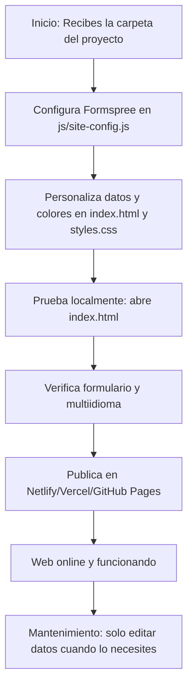

# Guía Interna para Cliente — ATEL SISTEMS (Frontend Only)

## Resumen Ejecutivo

Este documento es una guía práctica para la gestión, personalización y despliegue de la web corporativa de ATEL SISTEMS. El sistema es 100% frontend, sin dependencias de backend, y está optimizado para velocidad, seguridad y facilidad de mantenimiento.

---

## 1. ¿Qué puedes hacer con esta web?
- Publicar tu web corporativa en minutos.
- Recibir presupuestos por email (Formspree).
- Cambiar textos, colores, datos de empresa y mapas fácilmente.
- Multiidioma y diseño responsivo.
- Cumplimiento legal y seguridad activa.

---

## 2. Pasos para poner en marcha tu web

### 1. Configura Formspree
- Regístrate en https://formspree.io/
- Crea un formulario y copia el ID.
- Pega el ID en `js/site-config.js` en la línea `FORMSPREE_FORM_ID`.

### 2. Personaliza tus datos
- Edita `index.html` para cambiar nombre, teléfono, email y dirección.
- Cambia colores en `css/styles.css` (busca `--primary`).
- Edita mapas en `js/site-config.js` si tienes varias sedes.

### 3. Prueba localmente
- Abre `index.html` en tu navegador.
- Prueba el formulario de presupuesto y verifica que recibes el email.
- Cambia de idioma y revisa que todo se traduzca correctamente.

### 4. Publica tu web
- Sube la carpeta a Netlify, Vercel o GitHub Pages (ver guía rápida en `documentacion_final/QUICKSTART.md`).
- Tu web estará online en minutos, con HTTPS y optimización automática.

---

## 3. Mantenimiento y soporte
- No necesitas conocimientos técnicos avanzados.
- Si cambias datos de empresa o colores, solo edita los archivos indicados.
- Para dudas, consulta la documentación en la carpeta `documentacion_final/usuario/`.
- Si necesitas soporte técnico, contacta con el responsable de ATEL SISTEMS.

---

## 4. Árbol de actuación (resumen visual)

---

**Recuerda:**
- No hay panel de administración ni base de datos: todo se gestiona editando archivos.
- La seguridad y el cumplimiento legal están integrados y activos por defecto.
- La documentación técnica y de usuario está siempre disponible en la carpeta `documentacion_final/`.
