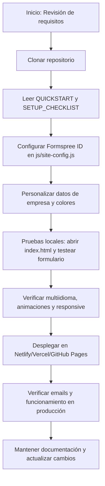

# Memoria Académica — ATEL SISTEMS (Frontend Only)

## 1. Introducción y Objetivo

Este documento describe el proceso de digitalización del catálogo de servicios de ATEL SISTEMS mediante una web corporativa moderna, rápida y 100% frontend. Se prioriza el rendimiento, la accesibilidad, el cumplimiento legal y la facilidad de despliegue, eliminando cualquier dependencia de backend.

## 2. Estado del Arte y Justificación Técnica

- **Stack:** HTML5 semántico, CSS3 (Grid, Flexbox, variables), JavaScript ES6+ modular.
- **Sin frameworks pesados:** Filosofía Vanilla Web para carga instantánea.
- **SPA simulada:** Navegación y formularios gestionados en el cliente.
- **Animaciones:** AOS (Animate On Scroll).
- **Multiidioma:** Motor i18n propio en JS.
- **Optimización:** Imágenes WebP, lazy loading, SEO avanzado (meta, JSON-LD, Schema.org).
- **Accesibilidad:** Uso de ARIA, navegación por teclado, diseño responsivo.

## 3. Seguridad y Cumplimiento Legal

- **Sin backend ni base de datos:** Elimina vectores de ataque clásicos (XSS, CSRF, SQLi, RCE).
- **Formularios:** Gestionados por Formspree (SaaS, antispam, honeypot, sin CSRF).
- **RGPD/LSSI:** Textos legales, política de cookies con opt-in explícito, contacto delegado de protección de datos.
- **Cabeceras de seguridad:** HTTPS por defecto en Netlify/Vercel/Cloudflare.

## 4. Metodología de Despliegue y Operación

- **100% frontend:** Compatible con Netlify, Vercel, GitHub Pages, Nginx, Apache.
- **Recomendación:** Hosting estático con CDN para máxima seguridad y coste mínimo.
- **Scripts de despliegue:** `deploy/package-local.sh` para empaquetado, instaladores para Linux y Windows.
- **Checklist y guías rápidas:** Documentación clara para usuarios y técnicos.

## 5. Documentación y Mantenimiento

- **Bloque usuario:** Guía rápida, checklist, guía de uso.
- **Bloque técnico:** Memoria técnica, revisión de seguridad, glosario, referencia de configuración, cambios.
- **Índices claros:** Documentación dividida por perfil y función.
- **Glosario técnico:** Explicación de términos y decisiones clave.
- **Historial de cambios:** Registro detallado de migración a frontend-only y eliminación de dependencias backend.

## 6. Cambios y Estado Actual

- Eliminado panel admin y rutas backend.
- Formularios migrados a Formspree: Sin CSRF, usando FormData.
- Todo el JS, CSS, HTML y lógica de negocio funcionan igual o mejor que en la versión original.
- No hay dependencias de backend ni archivos huérfanos.
- Validaciones, multiidioma, animaciones, SEO y accesibilidad están activos y probados.
- Checklist y guías reflejan el flujo real de despliegue y personalización.

## 7. Personalización y Configuración

- **Formspree:** Configura el ID en `js/site-config.js`.
- **Analytics:** Opcional, solo requiere Measurement ID.
- **Datos de empresa:** Edita en `index.html`.
- **Colores:** Personaliza en `css/styles.css`.
- **Mapas:** Configura enlaces y embeds en `js/site-config.js`.

## 8. Árbol de Actuación Explicativo

## 9. Revisión de Concordancia

- Toda la documentación, guías y scripts reflejan el estado actual del proyecto: 100% frontend, sin dependencias backend, con seguridad, accesibilidad y SEO activos.
- Los archivos de cambios y guías rápidas están alineados con los últimos avances y migraciones.
- El árbol de actuación cubre todo el ciclo real de uso y despliegue, desde la configuración hasta la puesta en producción y el mantenimiento.

---

**Anexos:**
- Índices de documentación, glosario técnico, referencias de configuración y cambios relevantes disponibles en la carpeta `documentacion_final/`.
