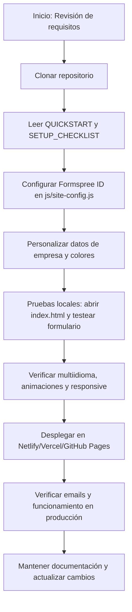

# Memoria Académica y Técnica — ATEL SISTEMS (Frontend Only)

---

## 1. Introducción y Objetivo

Este documento integra la memoria académica, la guía técnica y una explicación exhaustiva archivo por archivo del proyecto ATEL SISTEMS. Se detalla la arquitectura, el flujo de trabajo, la seguridad, el despliegue y el análisis de cada archivo relevante, con comentarios didácticos y referencias cruzadas.

---

## 2. Estructura General del Proyecto

- **index.html**: Página principal, SEO, accesibilidad, enlaces a todos los recursos.
- **presupuesto/index.html**: Formulario de captación de presupuestos, multiidioma, validación y honeypot.
- **certificaciones/index.html**: Página de certificaciones, tabla dinámica, multiidioma.
- **css/styles.css**: Variables, reset, layout, responsividad, temas y utilidades visuales.
- **js/main.js**: Lógica de interfaz, navegación, animaciones, i18n, eventos globales.
- **js/presupuesto.js**: Lógica del formulario de presupuesto, validación, envío a Formspree, tracking.
- **js/security.js**: Hardening en cliente, forzado HTTPS, frame busting, avisos de dominio.
- **js/site-config.js**: Configuración centralizada (Formspree, Analytics, mapas, contacto).
- **js/translations.js**: Diccionario multiidioma, textos legales, cookies, accesibilidad.
- **scripts/build-production.js**: Minificación, ofuscación y empaquetado para producción.
- **tests/security.test.js**: Pruebas automáticas de seguridad (XSS, tabnabbing).
- **tests/code-quality.test.js**: Linter y chequeos de calidad de CSS y JS.
- **tests/check-project.js**: Checklist de integridad y dependencias del proyecto.

---

## 3. Explicación de Archivos y Código (Archivo por Archivo)

### index.html
- Estructura semántica HTML5.
- Metaetiquetas SEO, Open Graph, Twitter, localización y accesibilidad.
- Carga de CSS y JS con fallback y versionado.
- Favicon y manifest para PWA.
- Comentarios didácticos sobre SEO y buenas prácticas.
- Enlaces a scripts de animaciones, traducción, seguridad y lógica principal.

### presupuesto/index.html
- Formulario con campos validados (nombre, empresa, email, teléfono, mensaje).
- Selector de idioma y multiidioma en todos los textos.
- Honeypot antispam (campo oculto).
- Envío a Formspree vía JS, sin backend propio.
- Accesibilidad: roles, labels, ARIA, feedback visual.
- Tracking de eventos y errores.

### certificaciones/index.html
- Tabla de certificaciones con definición, reglamento y aplicación.
- Multiidioma y selector de idioma.
- Accesibilidad: roles, ARIA, navegación por teclado.
- Carga de estilos y scripts optimizados.

### css/styles.css
- Variables CSS centralizadas en :root (colores, fuentes, transiciones).
- Reset y normalización cross-browser.
- Layout con Grid y Flexbox.
- Utilidades para responsividad y ocultar elementos en móvil.
- Comentarios didácticos y chistes dev para aprendizaje.
- Temas y clases para hero, tarjetas, botones, tablas, formularios.

### js/main.js
- Inicialización de galerías (baguetteBox).
- Gestión de idioma y traducciones (localStorage, data-i18n).
- Scroll inteligente al recargar.
- Eventos globales de navegación y animaciones.
- Modularidad y separación de responsabilidades.
- Comentarios explicativos para cada función clave.

### js/presupuesto.js
- Centrado dinámico de la tarjeta de presupuesto.
- Validación de campos y feedback en tiempo real.
- Envío seguro a Formspree usando FormData.
- Tracking de eventos (envío, errores, abandono).
- Funciones para obtener y cambiar idioma.
- Telemetría defensiva (no rompe si analytics no está disponible).
- Comentarios claros y didácticos.

### js/security.js
- Forzado de HTTPS fuera de localhost.
- Frame busting para evitar clickjacking.
- Aviso visual si el dominio no es de confianza.
- Listado de hosts permitidos.
- Comentarios sobre limitaciones de la seguridad en frontend.
- Ejemplo de defensa en profundidad.

### js/site-config.js
- Objeto global ATEL_CONFIG con:
  - FORMSPREE_FORM_ID: ID del formulario de presupuestos.
  - CONTACT_EMAIL: Email de contacto.
  - GOOGLE_ANALYTICS_ID: ID de Analytics.
  - MAPS: enlaces y embeds de Google Maps para sedes.
- Permite personalización rápida sin tocar el resto del código.

### js/translations.js
- Objeto translations con todos los textos traducibles.
- Idiomas soportados: es, en, fr, it, de, ru, uk, ar.
- Textos legales, cookies, accesibilidad, menús, formularios.
- Claves coinciden con data-i18n en HTML.
- Comentarios sobre estructura y ampliación.

### scripts/build-production.js
- Node.js: minifica HTML, CSS y JS.
- Ofusca JS propio con JavaScriptObfuscator.
- Usa CleanCSS y html-minifier-terser.
- Copia recursos a .dist/production.
- Elimina source maps y comentarios.
- Modular y extensible para otros entornos.

### tests/security.test.js
- Node.js: verifica enlaces target="_blank" con rel="noopener" (tabnabbing).
- Busca usos inseguros de innerHTML sin sanitización.
- Muestra advertencias y errores en consola.
- Permite modo verbose para depuración.

### tests/code-quality.test.js
- Node.js: chequea abuso de !important en CSS.
- Busca console.log en JS de producción.
- Muestra advertencias y errores.
- Incluye chistes dev para aprendizaje.

### tests/check-project.js
- Node.js: verifica existencia de archivos clave.
- Ejecuta scripts de test y muestra resultados.
- Lista referencias locales en HTML.
- Modular para ampliar con más chequeos.

---

## 4. Relación entre Archivos y Flujo de Trabajo

- **index.html** carga todos los recursos y es el punto de entrada.
- **js/main.js** y **js/translations.js** gestionan la experiencia de usuario y el multiidioma en todas las páginas.
- **js/presupuesto.js** y **presupuesto/index.html** trabajan juntos para la captación de leads.
- **js/security.js** protege todas las páginas cargadas.
- **css/styles.css** define la identidad visual y la responsividad.
- **scripts/build-production.js** y los tests aseguran calidad, seguridad y optimización antes de desplegar.
- **js/site-config.js** centraliza la configuración para facilitar el mantenimiento y la personalización.

---

## 5. Buenas Prácticas y Comentarios Didácticos

- Todos los archivos incluyen comentarios explicativos, chistes dev y advertencias sobre malas prácticas.
- El código es modular, seguro y fácil de mantener.
- Se prioriza la accesibilidad, el SEO y la experiencia de usuario.
- El sistema de tests automatizados permite detectar errores antes de producción.
- La configuración está separada del código para facilitar la adaptación a otros clientes o entornos.

---

## 6. Árbol de Actuación Explicativo

---

## 7. Conclusión y Revisión de Concordancia

- Toda la documentación, guías y scripts reflejan el estado actual del proyecto: 100% frontend, sin dependencias backend, con seguridad, accesibilidad y SEO activos.
- Los archivos de cambios y guías rápidas están alineados con los últimos avances y migraciones.
- El árbol de actuación cubre todo el ciclo real de uso y despliegue, desde la configuración hasta la puesta en producción y el mantenimiento.

---

**Anexos:**
- Índices de documentación, glosario técnico, referencias de configuración y cambios relevantes disponibles en la carpeta `documentacion_final/`.
